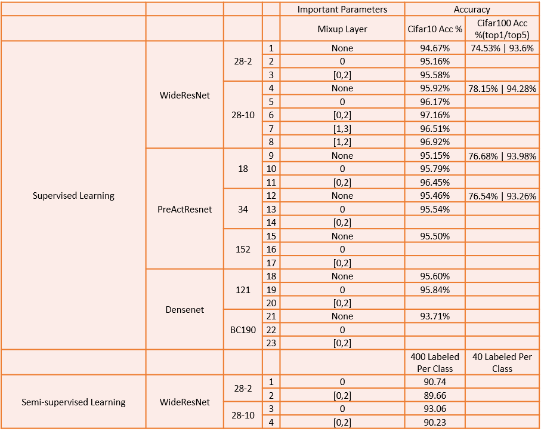

# Mixup Family
## Introduction

In this project, we mainly implement the mixup[1] and manifold mixup[2] algorithm on supervised and semi-supervised tasks in 3 datasets together with 3 neural networks(WideResNet[3],PreActResnet[4],DenseNet[5]).

The implementation almost achieves claimed results in the paper, and the main result are listed following. Details about parameters and some tricks need to pay attention to will be discussed in remaining sections.



## Requirements and Implementation Details

### Requirements

#### Package

```python
python >=3.5
Pytorch >=1.1.0
torchvision >= 0.2.1
pillow 
numpy
scikit-learn
```

#### Dataset

The dataset [`cifar10,cifar100` ](https://www.cs.toronto.edu/~kriz/cifar.html)should be stored under the folder `cifar` with the root

```python
path.join(basepath,"dataset","cifar")
```

The dataset [`svhn`](http://ufldl.stanford.edu/housenumbers/) should be arranged in the folder `svhn` with the root

```python
path.join(basepath,"dataset","svhn")
```

Here `basepath` is the arbitrary path under which you store the dataset.

### Implementation Details

The details of hyper-parameters and the related usage commands have been carefully listed in `TrainDetail.xlsx` file. 

Here are 3 parameters we should pay attention to:

* `basepath`

  Here `basepath` is the arbitrary path under which you store the dataset. We will also store the log of training under `bathpath`. For example, the supervised training record (written using `tensorboard`) of `Cifar10` is stored under

  ```python
  path.join(basepath,"Cifar10") 
  ```

  while the semi-supervised training record path is 

  ```python
  path.join(basepath,"Cifar10-SSL") 
  ```

* `dataset`

  The parameter `dataset` should be chosen from `Cifar10`, `Cifar100` and `SVHN`.

* `device_id`

  The available GPU id (e.g., `"0,1"`).

## ToDO

Complete the experiment and fill the blank in `TrainDetail.xlsx` .

## Reference

[1] Zhang, Hongyi, et al. "mixup: Beyond empirical risk minimization." *arXiv preprint arXiv:1710.09412* (2017).

[2] Verma, Vikas, et al. "Manifold mixup: Encouraging meaningful on-manifold interpolation as a regularizer." *stat* 1050 (2018): 13.

[3] Zagoruyko, Sergey, and Nikos Komodakis. "Wide residual networks." *arXiv preprint arXiv:1605.07146* (2016).

[4] He, Kaiming, et al. "Identity mappings in deep residual networks." *European conference on computer vision*. Springer, Cham, 2016.

[5] Huang, Gao, et al. "Densely connected convolutional networks." *Proceedings of the IEEE conference on computer vision and pattern recognition*. 2017.

